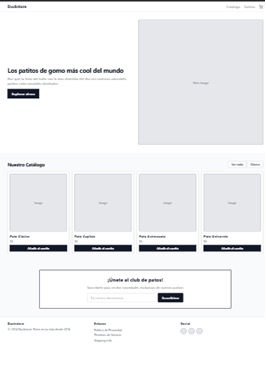
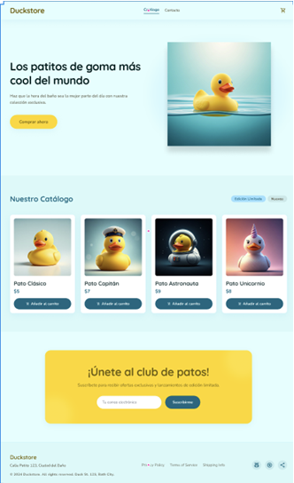

# PLAN:

1. Crear mockups en Google Stitch
2. Modificarlos en Figma para hacer imagenes de los bloques de sitio web. 
3. Crear un presentación en Canvas
4. Generar la historia de usuario
5. Realizar la estructura de Repositorio en GitHub
6. Desarrollo de la página web en HTML y CSS

## PROTOTIPOS:

